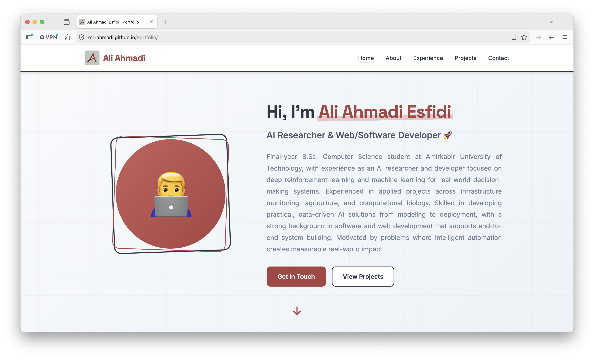

# Ali Ahmadi Esfidi - Portfolio Website

A modern, responsive personal portfolio website showcasing my academic journey, research experience, projects, and professional achievements in Computer Science, Machine Learning, and Computational Biology — with PWA support and an admin panel for content management.



## 🌟 Features

- **Responsive Design**: Fully responsive layout across desktop, tablet, and mobile
- **PWA Support**: Installable as a standalone app with offline caching via service worker
- **Self-Hosted Fonts**: Inter and Space Grotesk variable fonts served locally (no external CDN)
- **Smooth Animations**: Intersection Observer API for scroll-based fade-in animations
- **Glass Navbar**: Backdrop-filter blur navigation bar
- **Interactive Navigation**: Smooth scrolling with active section highlighting
- **Mobile-Friendly**: Optimized hamburger menu with click-outside-to-close
- **Accessibility**: Keyboard navigation, focus-visible indicators, reduced motion support
- **Back to Top**: Floating button appears on scroll
- **Custom Scrollbar**: Styled scrollbar matching the accent color

## 🎨 Design Highlights

- **Custom Color Palette**: Professional scheme with accent (#a94442), auto-adapting for dark mode
- **Typography**: Inter (body) and Space Grotesk (headings) self-hosted variable fonts
- **Sketch-Style Elements**: Hand-drawn aesthetic with decorative borders and highlights
- **Grid & Flexbox**: Modern CSS Grid and Flexbox for responsive layouts

## 📋 Sections

1. **Home**: Introduction with profile image and call-to-action buttons
2. **About**: Fields of interest, skills & technologies, CV download
3. **Experience**: Research positions, teaching assistantships, certificates, and publications
4. **Projects**: Showcase of key projects with descriptions, tags, and GitHub links (with detail modal)
5. **Contact**: Contact information and social media links

## 🛠️ Technologies Used

- **HTML5**: Semantic markup with PWA meta tags
- **CSS3**: Custom properties, Grid, Flexbox, backdrop-filter, dark mode queries
- **JavaScript (ES6+)**: Intersection Observer, dynamic rendering, service worker registration
- **Fonts**: Inter & Space Grotesk (self-hosted WOFF2 variable fonts)
- **Icons**: Font Awesome 6.4.0
- **Admin Panel**: React + Vite (separate app for content management)

## 🚀 Getting Started

### Prerequisites

- A modern web browser (Chrome, Firefox, Safari, Edge)

### Installation

1. Clone the repository:

```bash
git clone https://github.com/Mr-Ahmadi/portfolio.git
cd portfolio
```

2. Open `index.html` in your browser:

```bash
open index.html
```

### File Structure

```
Portfolio/
├── index.html              # Main HTML file
├── styles.css              # Stylesheet
├── script.js               # JavaScript functionality
├── sw.js                   # Service worker for PWA offline caching
├── manifest.json           # PWA manifest
├── fonts/
│   ├── fonts.css           # Self-hosted @font-face declarations
│   ├── Inter.woff2         # Inter variable font
│   └── SpaceGrotesk.woff2  # Space Grotesk variable font
├── icons/
│   ├── icon-192x192.png    # PWA icon
│   └── icon-512x512.png    # PWA icon
├── assets/
│   ├── a.png               # Logo / favicon
│   ├── preview.png         # Preview image for README
│   └── Curriculum_Vitae.pdf
├── admin/                  # React admin panel (separate app)
└── README.md
```

## ✨ Key Features Implementation

### Dark Mode
- Auto-detected via `prefers-color-scheme: dark`
- Adjusted backgrounds, text, borders, and accent colors
- Smooth color transitions

### PWA
- `manifest.json` for installable app experience
- `sw.js` service worker precaches all assets for offline use
- Icons at 192x192 and 512x512

### Self-Hosted Fonts
- Variable fonts (single file covers all weights)
- `font-display: swap` for optimal loading
- No external CDN dependency — works fully offline

### Smooth Scrolling & Nav Highlighting
- Custom smooth scroll for navigation links
- Real-time active section detection while scrolling

### Project Detail Modal
- Click any project card to open a full detail modal
- Keyboard (Escape) support, click-outside-to-close
- Full project description, tags, and GitHub link

## 🎯 Customization Guide

### Changing Colors

Edit CSS variables in `styles.css` — dark mode overrides are in the `@media (prefers-color-scheme: dark)` block.

### Modifying Content

Content is managed via the `PORTFOLIO_JSON` object in `script.js`, or through the admin panel at `admin/`.

## 📱 Responsive Breakpoints

- **Desktop**: > 968px
- **Tablet**: 768px – 968px
- **Mobile**: < 768px
- Uses `clamp()` for fluid typography and sizing

## 📄 Browser Support

- Chrome (latest)
- Firefox (latest)
- Safari (latest)
- Edge (latest)
- Mobile browsers (iOS Safari, Chrome Mobile)

## 📝 License

© 2025 Ali Ahmadi Esfidi. All rights reserved.

## 📧 Contact

- **Email**: <aliahmadiesfidi@outlook.com>
- **GitHub**: [@Mr-Ahmadi](https://github.com/Mr-Ahmadi)
- **LinkedIn**: [Ali Ahmadi Esfidi](https://linkedin.com/in/ali-ahmadi-esfidi)
- **Phone**: +98 904 4478 539

---

**Built with ❤️ by Ali Ahmadi Esfidi**
