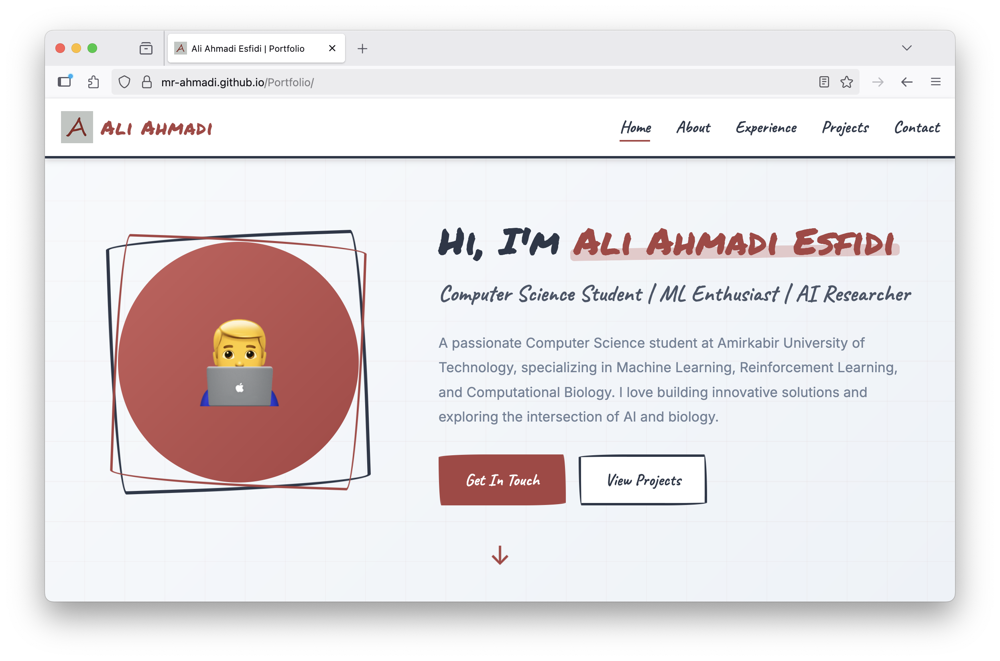

# Ali Ahmadi Esfidi - Portfolio Website

A modern, responsive personal portfolio website showcasing my academic journey, research experience, projects, and professional achievements in Computer Science, Machine Learning, and Computational Biology.



## 🌟 Features

- **Responsive Design**: Fully responsive layout that works seamlessly across desktop, tablet, and mobile devices
- **Smooth Animations**: Intersection Observer API for elegant scroll-based animations
- **Modern UI/UX**: Clean, professional design with custom color scheme and typography
- **Interactive Navigation**: Smooth scrolling navigation with active section highlighting
- **Mobile-Friendly**: Optimized hamburger menu for mobile devices
- **Performance Optimized**: Lazy loading images and debounced scroll events
- **Accessibility**: Focus management and keyboard navigation support

## 🎨 Design Highlights

- **Custom Color Palette**: Professional color scheme with accent colors (#a94442)
- **Typography**: Combination of 'Permanent Marker', 'Caveat', and 'Inter' fonts for visual hierarchy
- **Sketch-Style Elements**: Hand-drawn aesthetic with decorative borders and highlights
- **Grid-Based Layout**: Modern CSS Grid and Flexbox for responsive layouts

## 📋 Sections

1. **Home**: Introduction with profile image and call-to-action buttons
2. **About**: Personal information, education, skills, technologies, and coursework
3. **Experience**: Research positions, teaching assistantships, certificates, and publications
4. **Projects**: Showcase of key projects with descriptions and GitHub links
5. **Contact**: Contact information and social media links

## 🛠️ Technologies Used

- **HTML5**: Semantic markup structure
- **CSS3**: Modern styling with CSS variables, Grid, and Flexbox
- **JavaScript (ES6+)**: Interactive features and animations
- **Google Fonts**: Custom typography (Inter, Caveat, Permanent Marker)

## 🚀 Getting Started

### Prerequisites

- A modern web browser (Chrome, Firefox, Safari, Edge)
- Basic knowledge of HTML/CSS/JS for customization

### Installation

1. Clone the repository:

```bash
git clone https://github.com/Mr-Ahmadi/portfolio.git
cd portfolio
```

2. Open `index.html` in your browser:

```bash
open index.html
# or
start index.html
# or simply double-click the file
```

### File Structure

Portfolio/
├── index.html          # Main HTML file
├── styles.css          # Stylesheet
├── script.js           # JavaScript functionality
├── assets/
│   ├── a.png          # Logo image
│   └── Curriculum_Vitae.pdf  # CV document
└── README.md          # This file


## ✨ Key Features Implementation

### Smooth Scrolling

- Custom smooth scroll behavior for navigation links
- Automatic adjustment for fixed navbar height

### Active Navigation Highlighting

- Real-time active section detection while scrolling
- Visual feedback for current page section

### Mobile Navigation

- Responsive hamburger menu for mobile devices
- Click-outside-to-close functionality
- Scroll prevention when menu is open

### Intersection Observer Animations

- Fade-in animations for cards and timeline items
- Performance-optimized with threshold settings

### Accessibility Features

- Keyboard navigation support
- Focus indicators for interactive elements
- Semantic HTML structure
- External links security (`noopener noreferrer`)

## 🎯 Customization Guide

### Changing Colors

Edit CSS variables in `styles.css`:

```css
:root {
    --primary-color: #2d3748;
    --accent-color: #a94442;
    /* Modify other color variables */
}
```

### Adding New Sections

1. Add section HTML in `index.html`
2. Add navigation link in navbar
3. Style the section in `styles.css`
4. Update JavaScript arrays if needed

### Modifying Content

- Update personal information in the HTML
- Replace project details and links
- Update CV file in assets folder

## 📱 Responsive Breakpoints

- **Desktop**: > 768px
- **Tablet/Mobile**: ≤ 768px
- Uses `clamp()` for fluid typography scaling

## 🔧 JavaScript Features

- Debounced scroll events for performance
- Dynamic year update in footer
- Lazy loading preparation for images
- Console easter egg for developers
- Loading animations on page load

## 📄 Browser Support

- Chrome (latest)
- Firefox (latest)
- Safari (latest)
- Edge (latest)
- Mobile browsers (iOS Safari, Chrome Mobile)

## 📝 License

© 2025 Ali Ahmadi Esfidi. All rights reserved.

## 📧 Contact

- **Email**: <mr-ahmadi2004@outlook.com>
- **GitHub**: [@Mr-Ahmadi](https://github.com/Mr-Ahmadi)
- **LinkedIn**: [Ali Ahmadi Esfidi](https://linkedin.com/in/ali-ahmadi-esfidi)
- **Phone**: +98 904 4478 539

---

**Built with ❤️ by Ali Ahmadi Esfidi**
